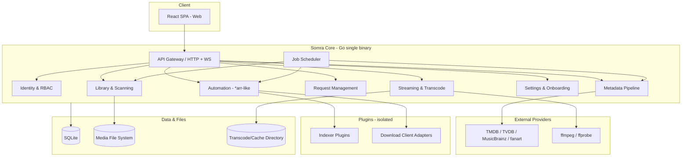

# Somra — Architecture

> System architecture, module boundaries, and data flow. All backend tasks must respect these
> module boundaries. Boundary changes are updated here first.

Related: [`project-brief.md`](./project-brief.md) · [`tech-stack.md`](./tech-stack.md) · [`roadmap.md`](./roadmap.md)

---

## 1. Architectural Principles

1. **Single binary, modular internals (modular monolith).** One Go executable with clearly
   bounded internal modules. No microservices (unnecessary ops burden for a home server).
2. **Zero mandatory external dependencies.** SQLite is embedded; no extra services (Postgres,
   Redis, etc.) required. ffmpeg is packaged in the image.
3. **Plugin architecture.** Legally sensitive or optional capabilities such as content acquisition
   (indexer/torrent/usenet) are **isolated** plugins separate from the core. See Sprint 09.
4. **API-first.** The UI and future clients use the same public API.
5. **Smart defaults.** Configuration is optional; the system self-tunes based on hardware/media detection.

## 2. High-Level Component Diagram

## 3. Modules (Ownership and Boundaries)

| Module | Responsibility | First introduced |
|---|---|---|
| **API Gateway** | HTTP REST + WebSocket/SSE, routing, validation, rate limit | Sprint 01 |
| **Identity & RBAC** | Users, sessions, roles, parental controls | Sprint 03 |
| **Library & Scanning** | File scanning, watching, matching, organization | Sprint 02 |
| **Metadata Pipeline** | External providers, matching, artwork/subtitle assets | Sprint 02 |
| **Streaming & Transcode** | Direct play, ffmpeg transcode, HLS/DASH, ABR | Sprint 04 |
| **Settings & Onboarding** | Setup wizard, smart defaults, system settings | Sprint 06 |
| **Request Management** | Request/approval flow, notifications | Sprint 08 |
| **Automation** | Quality profiles, grab, import, watchlists | Sprint 09 |
| **Plugin Framework** | Indexer + download client adapters | Sprint 09 |
| **Job Scheduler** | Periodic/async jobs (scan, refresh, automation) | Sprint 01 (skeleton), 02 (usage) |

## 4. Data Layer

- **Primary data:** SQLite (WAL mode). Schema migrations are versioned. See Sprint 01/02 database tasks.
- **Media files:** User-mounted volumes (read-only preferred; write optional for organization).
- **Cache/transcode directory:** Temporary HLS segments, thumbnails, downloaded artwork.

## 5. API Approach

- **Style:** REST (resource-oriented) + WebSocket/SSE for real-time events.
- **Versioning:** `/api/v1`. Breaking changes require a new version.
- **Identity:** Short-lived JWT access token + revocable server-side refresh token (DB), RBAC authorization.
- **Contract:** OpenAPI 3.1 (design-first, hand-authored spec) is the source of truth; frontend TypeScript types are generated from it.

## 6. Plugin Architecture (Summary)

- The core stays **neutral**; indexer/torrent/usenet capabilities are optional plugins.
- Clear interface contract: `Search`, `Capabilities`, `Download`, etc.
- Legal risk isolation: plugins can be packaged/distributed separately. See [`project-brief.md`](./project-brief.md) §7 and Sprint 09.

## 7. Cross-Cutting Concerns

- **Logging/observability:** Structured logs, optional metrics endpoint.
- **Configuration:** Environment variables + UI settings; convention over configuration.
- **Security:** Least privilege, input validation, secure defaults (see Sprint 10 security audit).
- **i18n/l10n:** Cross-cutting requirement. Source locale en-US, translation tr-TR. Locale negotiation
  (user preference → system default → `Accept-Language` → en-US fallback) applies to both frontend
  and backend message generation. See [`i18n-localization.md`](./i18n-localization.md).

## 8. Architectural Decisions (Closed)

> Open architectural decisions at plan start are now closed. Sprint 01 tasks **implement and
> validate** these decisions (not re-debate). Changes require Tech Lead approval + document update.

| Decision | Outcome |
|---|---|
| Session | Short-lived JWT access token + revocable refresh token (stored in DB) |
| API contract tooling | OpenAPI 3.1, design-first (hand-authored spec) → FE type generation |
| Job scheduler | Our lightweight scheduler + `robfig/cron/v3` (cron expressions) |
| Migration tool | `pressly/goose` (embedded `embed.FS` migrations) |
| SQLite driver | `modernc.org/sqlite` (pure Go, no CGO) |
| HTTP router | `go-chi/chi` |

For all technology decisions see [`tech-stack.md`](./tech-stack.md) §7.
