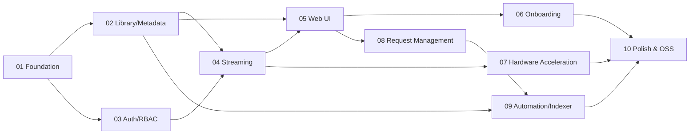

# Somra — Roadmap

> 10-sprint phase plan, dependencies, and milestones. Each sprint ends with a **working
> incremental release**. Default sprint cadence is 2 weeks; no hard deadline.

Related: [`project-brief.md`](./project-brief.md) · [`architecture.md`](./architecture.md) · [`ideal-team.md`](./ideal-team.md) · [`i18n-localization.md`](./i18n-localization.md)

---

## 1. Phase / Sprint Overview

| Sprint | Name | Main Output (Milestone) | Folder |
|---|---|---|---|
| 01 | Foundation & Architecture | Running skeleton service + CI/CD + Docker image skeleton + API contract | [`sprint-01-foundation/`](./sprint-01-foundation/) |
| 02 | Library & Metadata | Media scanning + enriched metadata + file watching | [`sprint-02-library-metadata/`](./sprint-02-library-metadata/) |
| 03 | Auth & Users | Multi-user + RBAC + profiles + parental controls + watch state | [`sprint-03-auth-users/`](./sprint-03-auth-users/) |
| 04 | Streaming & Transcode | Direct play + software transcode + HLS/DASH + subtitles | [`sprint-04-streaming-transcode/`](./sprint-04-streaming-transcode/) |
| 05 | Web UI | Library browsing + detail + web player + search | [`sprint-05-web-ui/`](./sprint-05-web-ui/) |
| 06 | Onboarding & Optimization | Setup wizard + smart defaults + subtitle automation | [`sprint-06-onboarding-optimization/`](./sprint-06-onboarding-optimization/) |
| 07 | Hardware Acceleration | QSV/NVENC/VAAPI/AMF + automatic selection | [`sprint-07-hardware-acceleration/`](./sprint-07-hardware-acceleration/) |
| 08 | Request Management | Request/approval flow + notifications | [`sprint-08-request-management/`](./sprint-08-request-management/) |
| 09 | Automation & Indexers | Plugin architecture + indexer (torrent+usenet) + download automation | [`sprint-09-automation-indexers/`](./sprint-09-automation-indexers/) |
| 10 | Polish & Open Source | Performance + documentation + security audit + OSS release | [`sprint-10-polish-oss-release/`](./sprint-10-polish-oss-release/) |

## 2. Dependency Flow

## 3. Milestone Definitions

- **M1 (Sprint 01):** Development skeleton ready; empty but running service via `docker run`.
- **M2 (Sprint 02–03):** User can log in and see scanned library with metadata (playback not yet).
- **M3 (Sprint 04–05):** End-to-end playback — video watchable in browser including transcode. **First usable alpha.**
- **M4 (Sprint 06–07):** Zero-config setup + hardware acceleration. **Beta candidate.**
- **M5 (Sprint 08–09):** Requests + automation + indexer. **Full parity phase entry.**
- **M6 (Sprint 10):** Open source release. **1.0.**

## 4. Cross-Sprint Rules

1. No sprint closes until acceptance criteria in its task files ([`definition-of-done.md`](./definition-of-done.md)) are met.
2. Next sprint **does not start** until dependent outputs from prior sprints are "Done".
3. Scope changes only via [`project-brief.md`](./project-brief.md) update.
4. Each sprint demo shows a working incremental release.
5. **i18n is cross-cutting:** User-facing text in every sprint ships with en-US + tr-TR (infrastructure in Sprint 01). See [`i18n-localization.md`](./i18n-localization.md) §7.

## 5. Risk Notes

- **Highest risk:** Streaming/transcode (Sprint 04) and hardware acceleration (Sprint 07) — codec/compatibility depth. Media specialist should be involved early.
- **Legal risk:** Indexer/automation (Sprint 09) — plugin isolation and license clarity required.
- **Scope risk:** "Full parity" goal is broad; anti-drift rules must be enforced strictly.
