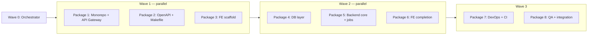

# Sprint 01 — Multitask Prompt Package

> **Purpose:** M1 milestone — empty but working Somra skeleton via `docker run`.  
> **Usage:** Agents Window → Cloud Agent (recommended) → `/multitask` → paste the prompts below in order or by wave.  
> **Repo status:** Greenfield (only `.plan/` + `AGENTS.md` exist).  
> **References:** [`AGENTS.md`](../../AGENTS.md) · [`01-architecture-tasks.md`](./01-architecture-tasks.md) · [`definition-of-done.md`](../definition-of-done.md)

---

## 0. Run this first — Orchestrator (single message)

```
Set up Sprint 01 (M1) foundation skeleton. Repo is greenfield; .plan/ and AGENTS.md are the single source of truth.

GOAL (M1):
- Go single binary compiles, starts, graceful shutdown
- GET /api/v1/health and GET /api/v1/version → 200
- SQLite WAL + goose migration (sample table)
- OpenAPI 3.1 spec → FE type generation
- React/Vite SPA skeleton shows health/version
- make lint test i18n-check coverage build docker green
- docker compose up → health responds

RULES (binding):
- Do not change technology: chi, modernc.org/sqlite, goose, TanStack Query, Tailwind, Radix — see .plan/tech-stack.md
- CGO-free build (modernc.org/sqlite)
- Code/comments/commits in English; user-facing text via i18n keys (en-US + tr-TR together)
- Module boundaries: .plan/architecture.md §3
- NO business logic (scanning, playback, auth logic — skeleton/contract only)
- Every PR/commit DCO: git commit -s
- Branch: feat/sprint-01-<package-name>

DIRECTORY STRUCTURE (AGENTS.md target):
cmd/ internal/ web/ migrations/ api/ deploy/ Makefile

Coordinate this message; split independent work across parallel subagents. Follow dependency order.
When done: make lint test i18n-check coverage build && docker compose up smoke test.
Do not open PR — leave on branch with commits; merge is up to the user.
```

---

## Wave plan (dependency order)



| Wave | Parallel? | Packages |
|---|---|---|
| 0 | No | Orchestrator (§0) |
| 1 | Yes (3 subagents) | §1 + §2 + §3 |
| 2 | Yes (3 subagents) | §4 + §5 + §6 |
| 3 | Sequential first §7, then §8 | DevOps → QA integration |

**Worktree recommendation:** Separate branch/worktree per package; merge to main branch in Wave 3.

---

## Package 1 — Monorepo skeleton + API Gateway

**Branch:** `feat/sprint-01-api-gateway`  
**Dependency:** None (Wave 1)

```
Branch: feat/sprint-01-api-gateway

Sprint 01 Package 1 — Monorepo skeleton + API Gateway.

Source: .plan/sprint-01-foundation/01-architecture-tasks.md (Epic A1–A3 partially, B, C)
AGENTS.md directory structure and .plan/architecture.md §3 module boundaries.

DO:
1. go.mod (module: github.com/somralab/somra-media or actual repo path)
2. Directories: cmd/somra/, internal/api/, internal/auth/, internal/library/, internal/metadata/, internal/streaming/, internal/settings/, internal/jobs/, internal/platform/ (config, log, errors)
3. chi router + middleware: request log, recover, CORS, rate-limit skeleton
4. GET /api/v1/health, GET /api/v1/version — unit tests
5. Bootstrap: config (env + defaults), structured logger, graceful shutdown (SIGTERM)
6. WebSocket/SSE skeleton: sample /api/v1/events/stream endpoint, test event broadcast
7. Auth skeleton (Sprint 03 contract): internal/auth/ package structure, JWT+refresh token interfaces (minimal implementation)

ACCEPTANCE:
- go test ./... passes (this package scope)
- curl localhost:8080/api/v1/health → 200 JSON
- Middleware unit tests exist
- golangci-lint clean

OUT OF SCOPE: domain business logic, real auth, DB tables (Package 4)

Commit: feat(api): add monorepo skeleton and api gateway foundation
DCO sign-off (-s). Do not open PR.
```

---

## Package 2 — OpenAPI spec + Makefile + go mod bootstrap

**Branch:** `feat/sprint-01-openapi-makefile`  
**Dependency:** None (Wave 1; health/version paths written to spec)

```
Branch: feat/sprint-01-openapi-makefile

Sprint 01 Package 2 — OpenAPI 3.1 + Makefile + repo root infrastructure.

Source: .plan/sprint-01-foundation/01-architecture-tasks.md (A4), 05-devops-tasks.md (C2)

DO:
1. api/openapi.yaml — OpenAPI 3.1: /api/v1/health, /api/v1/version schemas
2. Type generation pipeline for web/: openapi-typescript or oapi-codegen (compatible with AGENTS.md, script documented)
3. Root Makefile targets: dev, build, test, lint, migrate, coverage, docker, i18n-check (skeleton — CI Package 7 completes)
4. .gitignore (Go, Node, SQLite, .env)
5. README.md — development quick start (make dev, make test)

ACCEPTANCE:
- make build (minimal binary compiles or stub for now)
- Type generation from OpenAPI to web/src/api/generated/ (or equivalent) works
- Spec defines health/version endpoints

OUT OF SCOPE: CI workflow (Package 7), Docker (Package 7)

Commit: chore(foundation): add openapi spec and makefile targets
DCO sign-off (-s). Do not open PR.
```

---

## Package 3 — Frontend SPA skeleton (Vite + React)

**Branch:** `feat/sprint-01-frontend-scaffold`  
**Dependency:** None (Wave 1; API URL via env)

```
Branch: feat/sprint-01-frontend-scaffold

Sprint 01 Package 3 — React + Vite SPA skeleton (Wave 1, minimal API integration).

Source: .plan/sprint-01-foundation/04-frontend-tasks.md (Epic A, C partially)

DO:
1. web/ — Vite + React + TypeScript strict + Tailwind + Radix UI + pnpm
2. Router: layout + 2 routes (e.g. / status page, /about or /settings stub)
3. TanStack Query + Zustand skeleton
4. i18n: i18next + react-i18next; locales/en-US/common.json, locales/tr-TR/common.json
   - Key standard: domain.context.key
   - Language switcher UI; NO hardcoded text
5. Theme provider: token-based; themes cinematic (default), aurora, noir, minimal
   - Persistence via localStorage
   - New theme = add token set only
6. Base components: Button, Input, Card, Modal, Toast (Radix + accessible)
7. ESLint + Prettier config

ACCEPTANCE:
- pnpm --dir web run build succeeds
- pnpm --dir web run lint clean
- Theme changes instantly, remembered on reload
- Language en-US ↔ tr-TR works

OUT OF SCOPE: health/version API call (Package 6), WS client (Package 6), e2e (Package 8)

Commit: feat(web): add vite react spa scaffold with i18n and themes
DCO sign-off (-s). Do not open PR.
```

---

## Package 4 — SQLite + goose migration

**Branch:** `feat/sprint-01-database`  
**Dependency:** Package 1 (bootstrap hook point)

```
Branch: feat/sprint-01-database

Sprint 01 Package 4 — SQLite data layer + goose migration.

Source: .plan/sprint-01-foundation/03-database-tasks.md
Tech: modernc.org/sqlite (CGO-free), pressly/goose embed.FS

DO:
1. migrations/ — goose SQL migrations (sample: schema_migrations + settings stub table)
2. internal/platform/db/ — connection management: WAL, pragma, pool
3. Repository pattern skeleton + transaction helpers
4. Automatic migrate up on startup
5. Test: isolated temp DB, CRUD + rollback/commit tests, WAL concurrent read test
6. DB path: env SOMRA_DATA_DIR (default ./data), compatible with deploy volume strategy

ACCEPTANCE:
- go test ./internal/platform/db/... passes
- Application applies migration on startup
- PRAGMA integrity_check flow documented or tested

OUT OF SCOPE: users/media domain tables

Commit: feat(db): add sqlite wal layer with goose migrations
DCO sign-off (-s). Do not open PR.
```

---

## Package 5 — Backend core: scheduler + i18n + diagnostics

**Branch:** `feat/sprint-01-backend-core`  
**Dependency:** Package 1 + Package 4

```
Branch: feat/sprint-01-backend-core

Sprint 01 Package 5 — Job scheduler + backend i18n + diagnostics.

Source: .plan/sprint-01-foundation/02-backend-tasks.md

DO:
1. internal/jobs/ — robfig/cron/v3 + lightweight scheduler wrapper
   - Sample periodic job (heartbeat log)
   - Job status: running/success/error; overlap/collision protection
   - Job queue interface skeleton (for Sprint 02)
2. Enrich /api/v1/health: uptime, db status, scheduler status
3. Backend i18n: go-i18n/v2 + golang.org/x/text
   - active.en-US.toml, active.tr-TR.toml (errors namespace)
   - Locale negotiation: Accept-Language → en-US fallback
   - API error response: { code, messageKey, message } (localized)
4. Shared error types + JSON error envelope

ACCEPTANCE:
- Sample cron job logged and tested
- Sample error message returns Turkish with tr-TR locale
- go test ./internal/jobs/... passes

Commit: feat(backend): add job scheduler and backend i18n foundation
DCO sign-off (-s). Do not open PR.
```

---

## Package 6 — Frontend API integration + WS client

**Branch:** `feat/sprint-01-frontend-integration`  
**Dependency:** Package 2 (OpenAPI types) + Package 1 (API running) + Package 3 (SPA)

```
Branch: feat/sprint-01-frontend-integration

Sprint 01 Package 6 — FE API client + realtime + status UI.

Source: .plan/sprint-01-foundation/04-frontend-tasks.md (Epic B)

DO:
1. Typed HTTP client with OpenAPI-generated types (health, version)
2. TanStack Query: useHealth, useVersion hooks
3. Status page: display backend health/version with i18n keys
4. WS/SSE client skeleton: connect to /api/v1/events/stream, show latest event in UI
5. Date/number formatting example with Intl (demo area)
6. Component tests: base Button/Status (vitest); coverage target ≥70% skeleton

ACCEPTANCE:
- SPA connects to backend and renders health/version (with make dev)
- No hardcoded text; en-US + tr-TR keys complete
- pnpm --dir web test passes

Commit: feat(web): wire typed api client and status dashboard
DCO sign-off (-s). Do not open PR.
```

---

## Package 7 — DevOps: Docker + CI/CD

**Branch:** `feat/sprint-01-devops`  
**Dependency:** Packages 1–6 merged or in mergeable state

```
Branch: feat/sprint-01-devops

Sprint 01 Package 7 — Docker + CI/CD + Makefile completion.

Source: .plan/sprint-01-foundation/05-devops-tasks.md

DO:
1. deploy/Dockerfile — multi-stage: Go build (CGO_ENABLED=0) + web static + ffmpeg/ffprobe
2. deploy/docker-compose.yml — volumes: config, media, transcode-cache, data (SQLite)
3. .github/workflows/ci.yml — gates in order:
   lint → i18n-check → unit-test → integration-test → coverage-gate → build → image-build
4. golangci-lint config; web ESLint/Prettier CI step
5. i18n-check script: missing/unused keys, en-US/tr-TR completeness
6. coverage-gate: Go core ≥80%, FE components ≥70% (reasonable subset for Sprint 01 skeleton)
7. GHCR image-build skeleton (push on main/tag)
8. Complete Makefile targets: make docker, make dev, make i18n-check, make coverage

ACCEPTANCE:
- docker compose -f deploy/docker-compose.yml up → curl health 200
- CI workflow YAML valid (verify with act or push)
- make lint test i18n-check coverage build green

Commit: ci(devops): add docker multi-stage build and github actions pipeline
DCO sign-off (-s). Do not open PR.
```

---

## Package 8 — QA: test harness + integration + M1 validation

**Branch:** `feat/sprint-01-qa`  
**Dependency:** Package 7 (CI ready)

```
Branch: feat/sprint-01-qa

Sprint 01 Package 8 — QA automation + M1 smoke + documentation.

Source: .plan/sprint-01-foundation/06-qa-tasks.md

DO:
1. docs/testing-strategy.md — test pyramid, coverage policy (DoD §4.1)
2. docs/issue-severity.md — critical/high/medium/low
3. Backend integration test harness (testcontainers or temp sqlite — CGO-free)
4. E2E: Playwright skeleton — health status page smoke (web/)
5. Sprint closure checklist: docs/sprint-01-dod-checklist.md (DoD §1–§2 + i18n §6)
6. Merge all packages to main (resolve conflicts); run make lint test i18n-check coverage build docker
7. Update README: M1 demo steps

ACCEPTANCE:
- Integration + e2e smoke green in CI
- M1: docker run → health/version OK; SPA status page OK
- .plan/sprint-01-foundation/*.md tasks verifiable via checkboxes

Commit: test(qa): add integration and e2e harness for sprint 01
DCO sign-off (-s). Open PR — user awaits review.
```

---

## Integration prompt (end of Wave 3 — single message)

```
Merge all feat/sprint-01-* branches into a single integration branch: feat/sprint-01-m1

1. Resolve conflicts; do not change technology decisions
2. make lint test i18n-check coverage build docker — fix until all green
3. docker compose up smoke: health, version, SPA status, SSE/WS sample event
4. Complete missing en-US/tr-TR keys
5. Verify AGENTS.md target directory structure is complete
6. Single summary commit or logical commit series; DCO sign-off
7. PR body template (`.cursor/rules`):

## What / Why
Sprint 01 M1: working skeleton service + CI + Docker.

## Related task
.plan/sprint-01-foundation/ → M1 milestone

## Test
make lint test i18n-check coverage build docker
e2e health smoke

## Checklist
- [ ] DoD met
- [ ] i18n en-US + tr-TR
- [ ] CI green

Open PR but do not merge.
```

---

## Quick `/multitask` single message (5 parallel subagents)

To distribute all packages at once:

```
/multitask

Sprint 01 M1 foundation — 5 parallel subagents:

Subagent A → Package 1 (Monorepo + API Gateway) branch feat/sprint-01-api-gateway
Subagent B → Package 2 (OpenAPI + Makefile) branch feat/sprint-01-openapi-makefile
Subagent C → Package 3 (FE scaffold) branch feat/sprint-01-frontend-scaffold
Subagent D → Package 4 (DB) branch feat/sprint-01-database — align with Package 1 bootstrap interface
Subagent E → Package 5 (Backend core) branch feat/sprint-01-backend-core — align with Package 1+4

Shared rules: AGENTS.md, .plan/tech-stack.md, CGO-free, i18n en-US+tr-TR, DCO commits, no business logic.

After completion in order: Package 6 → 7 → 8 → Integration prompt.

Each subagent on completion: brief summary — files, test result, blockers.
```

---

## Morning review checklist (yours)

- [x] `make lint test i18n-check coverage build docker` green
- [x] `docker compose -f deploy/docker-compose.yml up --build` → `/api/v1/health` 200
- [x] SPA status page shows health/version
- [x] No hardcoded user-facing text (grep `"[A-Z][a-z]+ [a-z]+"` for suspicious areas)
- [x] Module boundaries compatible with `.plan/architecture.md` §3
- [x] CGO_ENABLED=0 build
- [x] Commits have `Signed-off-by:`
- [x] No out-of-scope feature creep (auth logic, library scan, transcode)

---

## Known risks and fallback

| Risk | Fallback prompt |
|---|---|
| Parallel branch conflict | Run integration prompt early; sequence Platform packages |
| CI coverage gate fails | "Define coverage subset for Sprint 01 skeleton; critical packages auth/jobs/api" |
| ffmpeg Docker build fail | "ffmpeg binary presence check sufficient for Sprint 01; transcode in Sprint 04" |
| i18n-check fail | "Complete missing tr-TR keys in common/errors namespace" |
