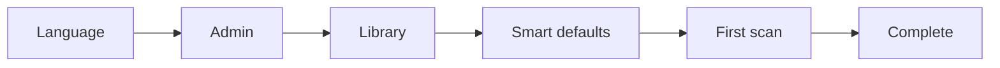

# Onboarding Flow (Sprint 06)

## Steps

| Step | API | Notes |
|------|-----|-------|
| Language | `POST /onboarding/step` `{ phase: "language", locale }` | Sets `system.default_locale` |
| Admin | `POST /setup/admin` | Creates first admin user |
| Library | `POST /libraries` | First media library |
| Defaults | `POST /onboarding/step` `{ phase: "defaults", applyDefaults: true }` | Applies CPU-based transcode + scan cron |
| Scan | `POST /libraries/{id}/scan` + SSE | Live progress via `/events/stream` |
| Complete | `POST /onboarding/complete` | Sets `onboarding.completed` |

## Routing

- `/setup/wizard` — multi-step wizard (when onboarding incomplete)
- `/login` — after onboarding + setup done
- `ProtectedRoute` redirects to wizard when onboarding incomplete

## Target

Fresh install to working server in **under 10 minutes**.
