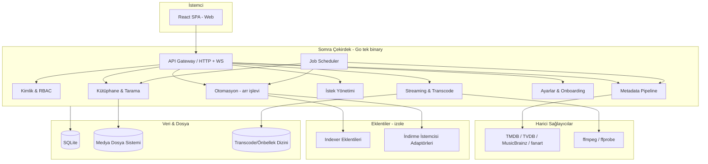

# Somra — Mimari (Architecture)

> Sistem mimarisi, modül sınırları ve veri akışı. Tüm backend görevleri bu modül sınırlarına
> uymak zorundadır. Sınır değişikliği önce burada güncellenir.

İlgili: [`project-brief.md`](./project-brief.md) · [`tech-stack.md`](./tech-stack.md) · [`roadmap.md`](./roadmap.md)

---

## 1. Mimari İlkeler

1. **Tek binary, modüler içyapı (modular monolith).** Go ile tek çalıştırılabilir; içeride
   net sınırlı modüller. Mikroservis yok (ev sunucusu için gereksiz operasyon yükü).
2. **Sıfır harici bağımlılık zorunluluğu.** SQLite gömülü; ek servis (Postgres, Redis vb.)
   gerekmez. ffmpeg imaja paketlenir.
3. **Eklenti mimarisi (plugin).** İçerik edinme (indexer/torrent/usenet) gibi yasal açıdan
   hassas veya opsiyonel yetenekler çekirdekten **izole** eklentiler olarak tasarlanır.
   Bkz. Sprint 09.
4. **API-first.** Arayüz ve gelecekteki istemciler aynı genel API'yi kullanır.
5. **Akıllı varsayılanlar.** Konfigürasyon opsiyoneldir; sistem donanım/medya tespitiyle
   kendini ayarlar.

## 2. Yüksek Seviye Bileşen Diyagramı

## 3. Modüller (Sahiplik ve Sınırlar)

| Modül | Sorumluluk | İlk geldiği sprint |
|---|---|---|
| **API Gateway** | HTTP REST + WebSocket/SSE, yönlendirme, doğrulama, rate limit | Sprint 01 |
| **Kimlik & RBAC** | Kullanıcı, oturum, roller, ebeveyn kontrolü | Sprint 03 |
| **Kütüphane & Tarama** | Dosya tarama, izleme (watch), eşleştirme, organizasyon | Sprint 02 |
| **Metadata Pipeline** | Harici sağlayıcılar, eşleştirme, görsel/altyazı varlıkları | Sprint 02 |
| **Streaming & Transcode** | Direct play, ffmpeg transcode, HLS/DASH, ABR | Sprint 04 |
| **Ayarlar & Onboarding** | Kurulum sihirbazı, akıllı varsayılanlar, sistem ayarları | Sprint 06 |
| **İstek Yönetimi** | İstek/onay akışı, bildirimler | Sprint 08 |
| **Otomasyon** | Kalite profilleri, kapma (grab), import, izleme listeleri | Sprint 09 |
| **Eklenti Çerçevesi** | Indexer + indirme istemcisi adaptörleri | Sprint 09 |
| **Job Scheduler** | Periyodik/asenkron işler (tarama, yenileme, otomasyon) | Sprint 01 (iskelet), 02 (kullanım) |

## 4. Veri Katmanı

- **Birincil veri:** SQLite (WAL modu). Şema migrasyonları sürümlenir. Bkz. Sprint 01/02 database görevleri.
- **Medya dosyaları:** Kullanıcının bağladığı volume'lar (salt-okuma tercih edilir; organizasyon için yazma opsiyonel).
- **Önbellek/transcode dizini:** Geçici HLS segmentleri, küçük resimler, indirilen görseller.

## 5. API Yaklaşımı

- **Stil:** REST (kaynak odaklı) + gerçek zamanlı olaylar için WebSocket/SSE.
- **Sürümleme:** `/api/v1`. Kırıcı değişiklik yeni sürüm gerektirir.
- **Kimlik:** JWT erişim token'ı (kısa ömürlü) + iptal edilebilir sunucu tarafı refresh token (DB), RBAC ile yetki.
- **Sözleşme:** OpenAPI 3.1 (design-first, elle yazılan spec) tek doğruluk kaynağı; frontend TypeScript tipleri buradan üretilir.

## 6. Eklenti Mimarisi (Özet)

- Çekirdek **tarafsız** kalır; indexer/torrent/usenet yetenekleri opsiyonel eklentilerdir.
- Net arayüz (interface) sözleşmesi: `Search`, `Capabilities`, `Download` vb.
- Yasal risk izolasyonu: eklentiler ayrı paketlenebilir/dağıtılabilir. Bkz. [`project-brief.md`](./project-brief.md) §7 ve Sprint 09.

## 7. Çapraz Kesen Konular (Cross-Cutting)

- **Loglama/gözlemlenebilirlik:** Yapılandırılmış log, opsiyonel metrik endpoint'i.
- **Konfigürasyon:** Ortam değişkenleri + arayüz ayarları; "convention over configuration".
- **Güvenlik:** En az yetki, girdi doğrulama, güvenli varsayılanlar (bkz. Sprint 10 güvenlik denetimi).
- **i18n/l10n:** Çapraz kesen zorunluluk. Kaynak dil en-US, çeviri tr-TR. Dil pazarlığı (kullanıcı tercihi → sistem varsayılanı → `Accept-Language` → en-US yedeği) hem frontend hem backend mesaj üretimini kapsar. Detay: [`i18n-localization.md`](./i18n-localization.md).

## 8. Mimari Kararlar (Kapatıldı)

> Plan başlangıcındaki açık mimari kararları kapatılmıştır. Sprint 01 görevleri bu kararları
> **uygular ve doğrular** (yeniden tartışmaz). Değişiklik Tech Lead onayı + doküman güncellemesi gerektirir.

| Karar | Sonuç |
|---|---|
| Oturum | JWT erişim token'ı (kısa ömürlü) + iptal edilebilir refresh token (DB'de saklanır) |
| API sözleşme aracı | OpenAPI 3.1, design-first (elle yazılan spec) → FE tip üretimi |
| Job scheduler | Kendi hafif zamanlayıcımız + `robfig/cron/v3` (cron ifadeleri) |
| Migrasyon aracı | `pressly/goose` (gömülü `embed.FS` migrasyonları) |
| SQLite sürücüsü | `modernc.org/sqlite` (saf Go, CGO'suz) |
| HTTP router | `go-chi/chi` |

Tüm teknoloji kararları için bkz. [`tech-stack.md`](./tech-stack.md) §7.
