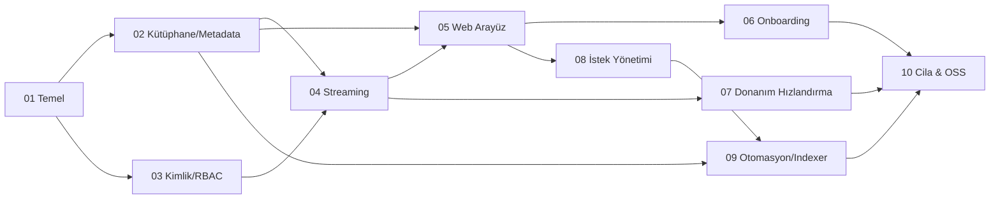

# Somra — Yol Haritası (Roadmap)

> 10 sprintlik faz planı, bağımlılıklar ve milestone'lar. Her sprint sonunda **çalışan
> artımlı bir sürüm** çıkar. Sprint kadansı varsayılan 2 hafta; katı deadline yoktur.

İlgili: [`project-brief.md`](./project-brief.md) · [`architecture.md`](./architecture.md) · [`ideal-team.md`](./ideal-team.md) · [`i18n-localization.md`](./i18n-localization.md)

---

## 1. Faz / Sprint Genel Görünüm

| Sprint | Ad | Ana Çıktı (Milestone) | Klasör |
|---|---|---|---|
| 01 | Temel & Mimari | Çalışan iskelet servis + CI/CD + Docker imaj iskeleti + API sözleşmesi | [`sprint-01-foundation/`](./sprint-01-foundation/) |
| 02 | Kütüphane & Metadata | Medya tarama + zenginleştirilmiş metadata + dosya izleme | [`sprint-02-library-metadata/`](./sprint-02-library-metadata/) |
| 03 | Kimlik & Kullanıcılar | Çoklu kullanıcı + RBAC + profiller + ebeveyn kontrolü + izleme durumu | [`sprint-03-auth-users/`](./sprint-03-auth-users/) |
| 04 | Streaming & Transcode | Direct play + yazılım transcode + HLS/DASH + altyazı | [`sprint-04-streaming-transcode/`](./sprint-04-streaming-transcode/) |
| 05 | Web Arayüz | Kütüphane gezinme + detay + web oynatıcı + arama | [`sprint-05-web-ui/`](./sprint-05-web-ui/) |
| 06 | Onboarding & Optimizasyon | Kurulum sihirbazı + akıllı varsayılanlar + altyazı otomasyonu | [`sprint-06-onboarding-optimization/`](./sprint-06-onboarding-optimization/) |
| 07 | Donanım Hızlandırma | QSV/NVENC/VAAPI/AMF + otomatik seçim | [`sprint-07-hardware-acceleration/`](./sprint-07-hardware-acceleration/) |
| 08 | İstek Yönetimi | İstek/onay akışı + bildirimler | [`sprint-08-request-management/`](./sprint-08-request-management/) |
| 09 | Otomasyon & Indexer | Eklenti mimarisi + indexer (torrent+usenet) + indirme otomasyonu | [`sprint-09-automation-indexers/`](./sprint-09-automation-indexers/) |
| 10 | Cila & Açık Kaynak | Performans + dokümantasyon + güvenlik denetimi + OSS yayın | [`sprint-10-polish-oss-release/`](./sprint-10-polish-oss-release/) |

## 2. Bağımlılık Akışı

## 3. Milestone Tanımları

- **M1 (Sprint 01):** Geliştirme iskeleti hazır; `docker run` ile boş ama çalışan servis ayağa kalkar.
- **M2 (Sprint 02–03):** Kullanıcı giriş yapıp taranmış kütüphaneyi metadata'sıyla görebilir (oynatma henüz yok).
- **M3 (Sprint 04–05):** Uçtan uca oynatma — tarayıcıda transcode dahil video izlenebilir. **İlk kullanılabilir alfa.**
- **M4 (Sprint 06–07):** Sıfır-konfig kurulum + donanım hızlandırma. **Beta adayı.**
- **M5 (Sprint 08–09):** İstek + otomasyon + indexer. **Tam parite fazına giriş.**
- **M6 (Sprint 10):** Açık kaynak yayın. **1.0.**

## 4. Çapraz Sprint Kuralları

1. Her sprint kendi klasöründeki görev dosyalarındaki kabul kriterlerini ([`definition-of-done.md`](./definition-of-done.md)) karşılamadan kapanmaz.
2. Sonraki sprint, önceki sprintin bağımlı çıktıları "Done" olmadan **başlamaz**.
3. Kapsam değişiklikleri yalnızca [`project-brief.md`](./project-brief.md) güncellenerek yapılır.
4. Her sprint demosunda çalışan artımlı sürüm gösterilir.
5. **i18n çapraz kesendir:** Her sprintte üretilen kullanıcıya görünen metinler en-US + tr-TR ile birlikte gelir (Sprint 01'de altyapı kurulur). Bkz. [`i18n-localization.md`](./i18n-localization.md) §7.

## 5. Risk Notları

- **En yüksek risk:** Streaming/transcode (Sprint 04) ve donanım hızlandırma (Sprint 07) — kodek/uyumluluk derinliği. Medya uzmanı erken devrede olmalı.
- **Yasal risk:** Indexer/otomasyon (Sprint 09) — eklenti izolasyonu ve lisans netliği şart.
- **Kapsam riski:** "Tam parite" hedefi geniş; anti-drift kuralları sıkı uygulanmalı.
