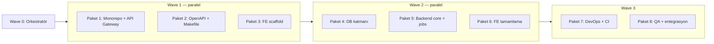

# Sprint 01 — Multitask Prompt Paketi

> **Amaç:** M1 milestone — `docker run` ile boş ama çalışan Somra iskeleti.  
> **Kullanım:** Agents Window → Cloud Agent (önerilir) → `/multitask` → aşağıdaki promptları sırayla veya dalga (wave) bazında yapıştır.  
> **Repo durumu:** Greenfield (yalnızca `plan/` + `AGENTS.md` mevcut).  
> **Referanslar:** [`AGENTS.md`](../../AGENTS.md) · [`01-architecture-tasks.md`](./01-architecture-tasks.md) · [`definition-of-done.md`](../definition-of-done.md)

---

## 0. Önce bunu çalıştır — Orkestratör (tek mesaj)

```
Sprint 01 (M1) foundation iskeletini kur. Repo greenfield; plan/ ve AGENTS.md tek doğruluk kaynağı.

HEDEF (M1):
- Go tek binary derlenir, ayağa kalkar, graceful shutdown yapar
- GET /api/v1/health ve GET /api/v1/version → 200
- SQLite WAL + goose migrasyon (örnek tablo)
- OpenAPI 3.1 spec → FE tip üretimi
- React/Vite SPA iskeleti health/version gösterir
- make lint test i18n-check coverage build docker yeşil
- docker compose up → health yanıt verir

KURALLAR (bağlayıcı):
- Teknoloji değiştirme: chi, modernc.org/sqlite, goose, TanStack Query, Tailwind, Radix — bkz. plan/tech-stack.md
- CGO'suz build (modernc.org/sqlite)
- Kod/yorum/commit İngilizce; kullanıcı metni i18n anahtarı (en-US + tr-TR birlikte)
- Modül sınırları: plan/architecture.md §3
- İş mantığı YOK (tarama, oynatma, auth logic — sadece iskelet/sözleşme)
- Her PR/commit DCO: git commit -s
- Branch: feat/sprint-01-<paket-adı>

DIZIN YAPISI (AGENTS.md hedefi):
cmd/ internal/ web/ migrations/ api/ deploy/ Makefile

Bu mesajı koordine et; bağımsız işleri paralel subagent'lara böl. Bağımlılık sırasına uy.
Bitince: make lint test i18n-check coverage build && docker compose up smoke test.
PR açma — commit'le branch'te bırak; merge kullanıcıya bırak.
```

---

## Dalga planı (bağımlılık sırası)



| Dalga | Paralel mi? | Paketler |
|---|---|---|
| 0 | Hayır | Orkestratör (§0) |
| 1 | Evet (3 subagent) | §1 + §2 + §3 |
| 2 | Evet (3 subagent) | §4 + §5 + §6 |
| 3 | Sıralı önce §7, sonra §8 | DevOps → QA entegrasyon |

**Worktree önerisi:** Her paket için ayrı branch/worktree; Wave 3'te ana branch'e merge.

---

## Paket 1 — Monorepo iskelet + API Gateway

**Branch:** `feat/sprint-01-api-gateway`  
**Bağımlılık:** Yok (Wave 1)

```
Branch: feat/sprint-01-api-gateway

Sprint 01 Paket 1 — Monorepo iskelet + API Gateway.

Kaynak: plan/sprint-01-foundation/01-architecture-tasks.md (Epik A1–A3 kısmen, B, C)
AGENTS.md dizin yapısı ve plan/architecture.md §3 modül sınırları.

YAP:
1. go.mod (module: github.com/somralab/somra-media veya repo'daki gerçek path)
2. Dizinler: cmd/somra/, internal/api/, internal/auth/, internal/library/, internal/metadata/, internal/streaming/, internal/settings/, internal/jobs/, internal/platform/ (config, log, errors)
3. chi router + middleware: request log, recover, CORS, rate-limit iskeleti
4. GET /api/v1/health, GET /api/v1/version — birim testleri
5. Bootstrap: config (env + varsayılan), structured logger, graceful shutdown (SIGTERM)
6. WebSocket/SSE iskelet: örnek /api/v1/events/stream endpoint, test event yayını
7. Auth iskelet (Sprint 03 sözleşmesi): internal/auth/ paket yapısı, JWT+refresh token interface'leri (implementasyon minimal)

KABUL:
- go test ./... geçer (bu paket kapsamı)
- curl localhost:8080/api/v1/health → 200 JSON
- Middleware birim testleri var
- golangci-lint temiz

KAPSAM DIŞI: domain iş mantığı, gerçek auth, DB tabloları (Paket 4'te)

Commit: feat(api): add monorepo skeleton and api gateway foundation
DCO sign-off (-s). PR açma.
```

---

## Paket 2 — OpenAPI spec + Makefile + go mod bootstrap

**Branch:** `feat/sprint-01-openapi-makefile`  
**Bağımlılık:** Yok (Wave 1; health/version path'leri spec'e yazılır)

```
Branch: feat/sprint-01-openapi-makefile

Sprint 01 Paket 2 — OpenAPI 3.1 + Makefile + repo kök altyapı.

Kaynak: plan/sprint-01-foundation/01-architecture-tasks.md (A4), 05-devops-tasks.md (C2)

YAP:
1. api/openapi.yaml — OpenAPI 3.1: /api/v1/health, /api/v1/version şemaları
2. web/ için tip üretim hattı: openapi-typescript veya oapi-codegen (AGENTS.md ile uyumlu, script dokümante)
3. Kök Makefile hedefleri: dev, build, test, lint, migrate, coverage, docker, i18n-check (iskelet — CI Paket 7 tamamlar)
4. .gitignore (Go, Node, SQLite, .env)
5. README.md — geliştirme hızlı başlangıç (make dev, make test)

KABUL:
- make build (henüz minimal binary derlenebilir veya stub)
- OpenAPI'den web/src/api/generated/ (veya eşdeğer) tip üretimi çalışır
- Spec health/version endpoint'lerini tanımlar

KAPSAM DIŞI: CI workflow (Paket 7), Docker (Paket 7)

Commit: chore(foundation): add openapi spec and makefile targets
DCO sign-off (-s). PR açma.
```

---

## Paket 3 — Frontend SPA iskelet (Vite + React)

**Branch:** `feat/sprint-01-frontend-scaffold`  
**Bağımlılık:** Yok (Wave 1; API URL env ile)

```
Branch: feat/sprint-01-frontend-scaffold

Sprint 01 Paket 3 — React + Vite SPA iskelet (Wave 1, API entegrasyonu minimal).

Kaynak: plan/sprint-01-foundation/04-frontend-tasks.md (Epik A, C kısmen)

YAP:
1. web/ — Vite + React + TypeScript strict + Tailwind + Radix UI + pnpm
2. Router: layout + 2 rota (ör. / status sayfası, /about veya /settings stub)
3. TanStack Query + Zustand iskelet
4. i18n: i18next + react-i18next; locales/en-US/common.json, locales/tr-TR/common.json
   - Anahtar standardı: domain.context.key
   - Dil değiştirici UI; hardcoded metin YOK
5. Theme provider: token tabanlı; temalar cinematic (default), aurora, noir, minimal
   - localStorage ile kalıcılık
   - Yeni tema = yalnızca token seti ekleme
6. Temel bileşenler: Button, Input, Card, Modal, Toast (Radix + erişilebilir)
7. ESLint + Prettier config

KABUL:
- pnpm --dir web run build başarılı
- pnpm --dir web run lint temiz
- Tema anında değişir, reload'da hatırlanır
- Dil en-US ↔ tr-TR çalışır

KAPSAM DIŞI: health/version API çağrısı (Paket 6), WS client (Paket 6), e2e (Paket 8)

Commit: feat(web): add vite react spa scaffold with i18n and themes
DCO sign-off (-s). PR açma.
```

---

## Paket 4 — SQLite + goose migrasyon

**Branch:** `feat/sprint-01-database`  
**Bağımlılık:** Paket 1 (bootstrap hook noktası)

```
Branch: feat/sprint-01-database

Sprint 01 Paket 4 — SQLite veri katmanı + goose migrasyon.

Kaynak: plan/sprint-01-foundation/03-database-tasks.md
Tech: modernc.org/sqlite (CGO-free), pressly/goose embed.FS

YAP:
1. migrations/ — goose SQL migrasyonları (örnek: schema_migrations + settings stub tablosu)
2. internal/platform/db/ — bağlantı yönetimi: WAL, pragma, pool
3. Repository deseni iskelet + transaction helpers
4. Startup'ta otomatik migrate up
5. Test: izole temp DB, CRUD + rollback/commit testleri, WAL concurrent read testi
6. DB path: env SOMRA_DATA_DIR (default ./data), deploy volume stratejisiyle uyumlu

KABUL:
- go test ./internal/platform/db/... geçer
- Uygulama açılışta migrasyon uygular
- PRAGMA integrity_check akışı dokümante veya test edilir

KAPSAM DIŞI: users/media domain tabloları

Commit: feat(db): add sqlite wal layer with goose migrations
DCO sign-off (-s). PR açma.
```

---

## Paket 5 — Backend core: scheduler + i18n + diagnostics

**Branch:** `feat/sprint-01-backend-core`  
**Bağımlılık:** Paket 1 + Paket 4

```
Branch: feat/sprint-01-backend-core

Sprint 01 Paket 5 — Job scheduler + backend i18n + diagnostics.

Kaynak: plan/sprint-01-foundation/02-backend-tasks.md

YAP:
1. internal/jobs/ — robfig/cron/v3 + hafif scheduler wrapper
   - Örnek periyodik job (heartbeat log)
   - Job status: running/success/error; overlap/collision koruması
   - Job queue interface iskeleti (Sprint 02 için)
2. /api/v1/health zenginleştir: uptime, db status, scheduler status
3. Backend i18n: go-i18n/v2 + golang.org/x/text
   - active.en-US.toml, active.tr-TR.toml (errors namespace)
   - Locale negotiation: Accept-Language → en-US fallback
   - API hata yanıtı: { code, messageKey, message } (localized)
4. Ortak error types + JSON error envelope

KABUL:
- Örnek cron job loglanır, test edilir
- Locale tr-TR ile örnek hata mesajı Türkçe döner
- go test ./internal/jobs/... geçer

Commit: feat(backend): add job scheduler and backend i18n foundation
DCO sign-off (-s). PR açma.
```

---

## Paket 6 — Frontend API entegrasyonu + WS client

**Branch:** `feat/sprint-01-frontend-integration`  
**Bağımlılık:** Paket 2 (OpenAPI tipleri) + Paket 1 (API ayakta) + Paket 3 (SPA)

```
Branch: feat/sprint-01-frontend-integration

Sprint 01 Paket 6 — FE API client + realtime + status UI.

Kaynak: plan/sprint-01-foundation/04-frontend-tasks.md (Epik B)

YAP:
1. OpenAPI'den üretilmiş tiplerle tipli HTTP client (health, version)
2. TanStack Query: useHealth, useVersion hooks
3. Status sayfası: backend health/version bilgisini i18n anahtarlarıyla göster
4. WS/SSE client iskelet: /api/v1/events/stream bağlan, son olayı UI'da göster
5. Intl ile tarih/sayı format örneği (demo alanı)
6. Bileşen testleri: temel Button/Status (vitest); coverage hedefi ≥%70 iskelet

KABUL:
- SPA backend'e bağlanıp health/version render eder (make dev ile)
- Hardcoded metin yok; en-US + tr-TR anahtarları tam
- pnpm --dir web test geçer

Commit: feat(web): wire typed api client and status dashboard
DCO sign-off (-s). PR açma.
```

---

## Paket 7 — DevOps: Docker + CI/CD

**Branch:** `feat/sprint-01-devops`  
**Bağımlılık:** Paket 1–6 merge edilmiş veya birleştirilebilir durumda

```
Branch: feat/sprint-01-devops

Sprint 01 Paket 7 — Docker + CI/CD + Makefile tamamlama.

Kaynak: plan/sprint-01-foundation/05-devops-tasks.md

YAP:
1. deploy/Dockerfile — multi-stage: Go build (CGO_ENABLED=0) + web static + ffmpeg/ffprobe
2. deploy/docker-compose.yml — volumes: config, media, transcode-cache, data (SQLite)
3. .github/workflows/ci.yml — kapılar sırasıyla:
   lint → i18n-check → unit-test → integration-test → coverage-gate → build → image-build
4. golangci-lint config; web ESLint/Prettier CI adımı
5. i18n-check script: eksik/kullanılmayan anahtar, en-US/tr-TR tamlık
6. coverage-gate: Go core ≥80%, FE components ≥70% (Sprint 01 iskelet için makul alt küme)
7. GHCR image-build iskelet (push main/tag'de)
8. Makefile hedeflerini tamamla: make docker, make dev, make i18n-check, make coverage

KABUL:
- docker compose -f deploy/docker-compose.yml up → curl health 200
- CI workflow YAML geçer (act veya push ile doğrula)
- make lint test i18n-check coverage build yeşil

Commit: ci(devops): add docker multi-stage build and github actions pipeline
DCO sign-off (-s). PR açma.
```

---

## Paket 8 — QA: test çatısı + entegrasyon + M1 doğrulama

**Branch:** `feat/sprint-01-qa`  
**Bağımlılık:** Paket 7 (CI hazır)

```
Branch: feat/sprint-01-qa

Sprint 01 Paket 8 — QA otomasyon + M1 smoke + dokümantasyon.

Kaynak: plan/sprint-01-foundation/06-qa-tasks.md

YAP:
1. docs/testing-strategy.md — test piramidi, coverage politikası (DoD §4.1)
2. docs/issue-severity.md — kritik/yüksek/orta/düşük
3. Backend integration test harness (testcontainers veya temp sqlite — CGO-free)
4. E2E: Playwright iskelet — health status sayfası smoke (web/)
5. Sprint kapanış checklist: docs/sprint-01-dod-checklist.md (DoD §1–§2 + i18n §6)
6. Tüm paketleri main'e merge et (conflict çöz); make lint test i18n-check coverage build docker koş
7. README güncelle: M1 demo adımları

KABUL:
- CI'da integration + e2e smoke yeşil
- M1: docker run → health/version OK; SPA status sayfası OK
- plan/sprint-01-foundation/*.md görevleri checkbox olarak doğrulanabilir durumda

Commit: test(qa): add integration and e2e harness for sprint 01
DCO sign-off (-s). PR açma — kullanıcı review bekler.
```

---

## Entegrasyon promptu (Wave 3 sonu — tek mesaj)

```
Tüm feat/sprint-01-* branch'lerini tek integration branch'te birleştir: feat/sprint-01-m1

1. Conflict çöz; teknoloji kararlarını değiştirme
2. make lint test i18n-check coverage build docker — hepsi yeşil olana kadar düzelt
3. docker compose up smoke: health, version, SPA status, SSE/WS örnek olay
4. Eksik en-US/tr-TR anahtarlarını tamamla
5. AGENTS.md'deki hedef dizin yapısının tamamlandığını doğrula
6. Tek özet commit veya mantıklı commit serisi; DCO sign-off
7. PR body şablonu (plan/.cursor kuralları):

## Ne / Neden
Sprint 01 M1: çalışan iskelet servis + CI + Docker.

## İlgili görev
plan/sprint-01-foundation/ → M1 milestone

## Test
make lint test i18n-check coverage build docker
e2e health smoke

## Kontrol
- [ ] DoD karşılandı
- [ ] i18n en-US + tr-TR
- [ ] CI yeşil

PR aç ama merge etme.
```

---

## Hızlı `/multitask` tek mesaj (5 paralel subagent)

Tüm paketleri tek seferde dağıtmak için:

```
/multitask

Sprint 01 M1 foundation — 5 paralel subagent:

Subagent A → Paket 1 (Monorepo + API Gateway) branch feat/sprint-01-api-gateway
Subagent B → Paket 2 (OpenAPI + Makefile) branch feat/sprint-01-openapi-makefile
Subagent C → Paket 3 (FE scaffold) branch feat/sprint-01-frontend-scaffold
Subagent D → Paket 4 (DB) branch feat/sprint-01-database — Paket 1 bootstrap interface'ine uy
Subagent E → Paket 5 (Backend core) branch feat/sprint-01-backend-core — Paket 1+4'e uy

Ortak kurallar: AGENTS.md, plan/tech-stack.md, CGO-free, i18n en-US+tr-TR, DCO commits, no business logic.

Bittikteninde sırayla: Paket 6 → 7 → 8 → Entegrasyon promptu.

Her subagent bitince kısa özet: dosyalar, test sonucu, blocker.
```

---

## Sabah review checklist (sizin)

- [ ] `make lint test i18n-check coverage build docker` yeşil
- [ ] `docker compose up` → `/api/v1/health` 200
- [ ] SPA status sayfası health/version gösteriyor
- [ ] Hardcoded kullanıcı metni yok (grep `"[A-Z][a-z]+ [a-z]+"` şüpheli alanlar)
- [ ] Modül sınırları `plan/architecture.md` §3 ile uyumlu
- [ ] CGO_ENABLED=0 build
- [ ] Commit'lerde `Signed-off-by:` var
- [ ] Kapsam dışı feature creep yok (auth logic, library scan, transcode)

---

## Bilinen riskler ve fallback

| Risk | Fallback prompt |
|---|---|
| Paralel branch conflict | Entegrasyon promptunu erken çalıştır; Platform paketlerini sırala |
| CI coverage gate kırılır | "Sprint 01 iskelet için coverage alt kümesi tanımla; kritik paketler auth/jobs/api" |
| ffmpeg Docker build fail | "Sprint 01'de ffmpeg binary presence check yeterli; transcode Sprint 04" |
| i18n-check fail | "Eksik tr-TR anahtarlarını common/errors namespace'inde tamamla" |
